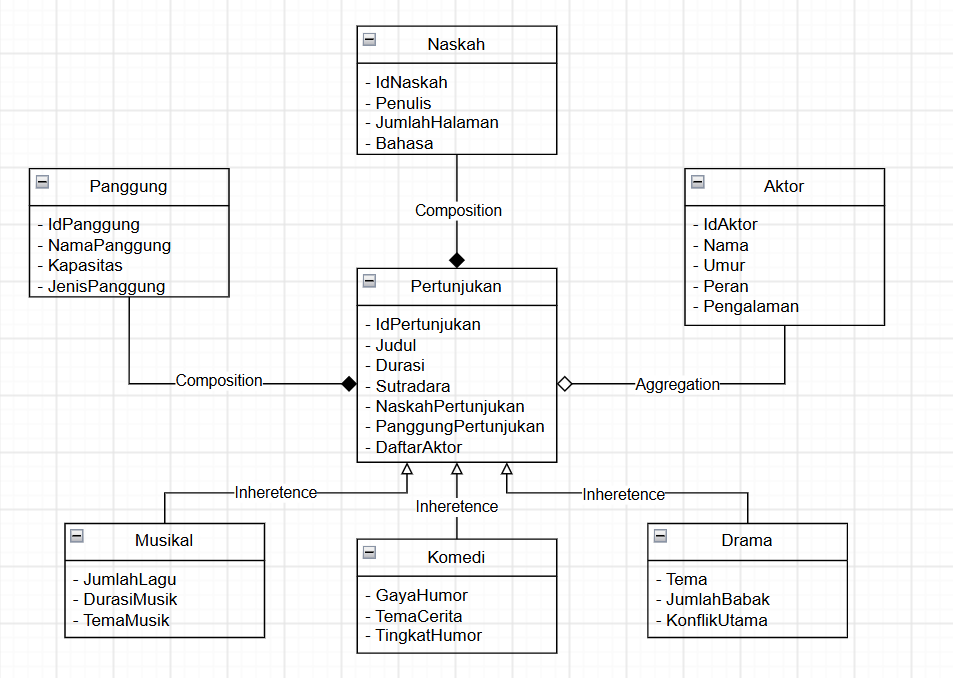
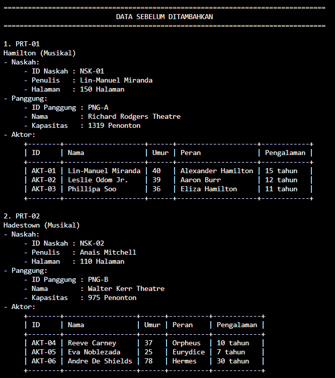
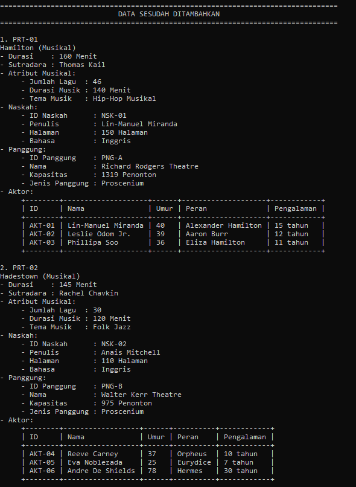
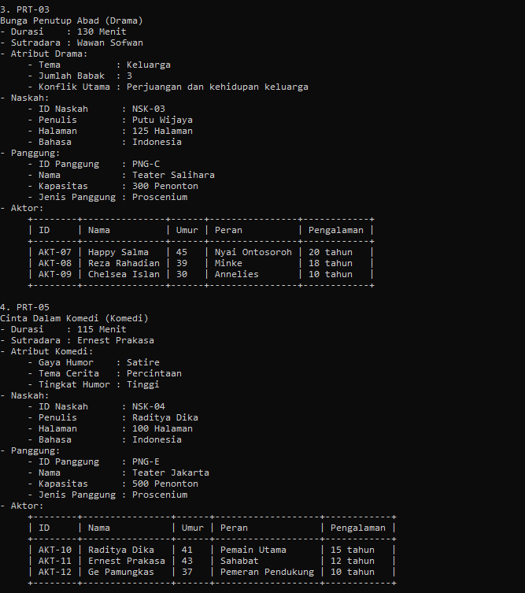
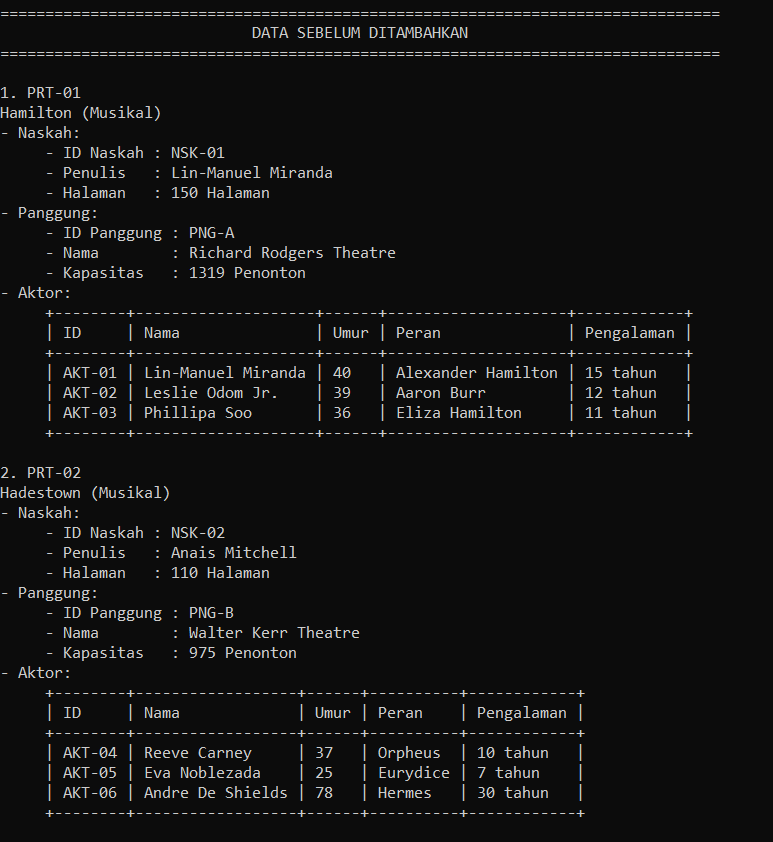
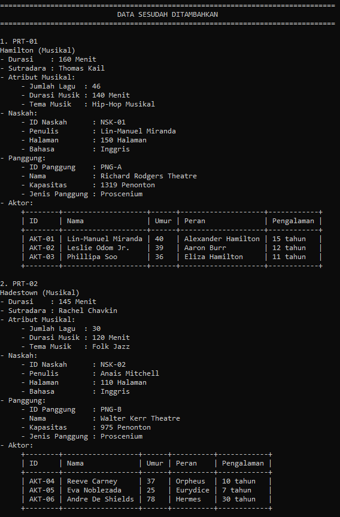
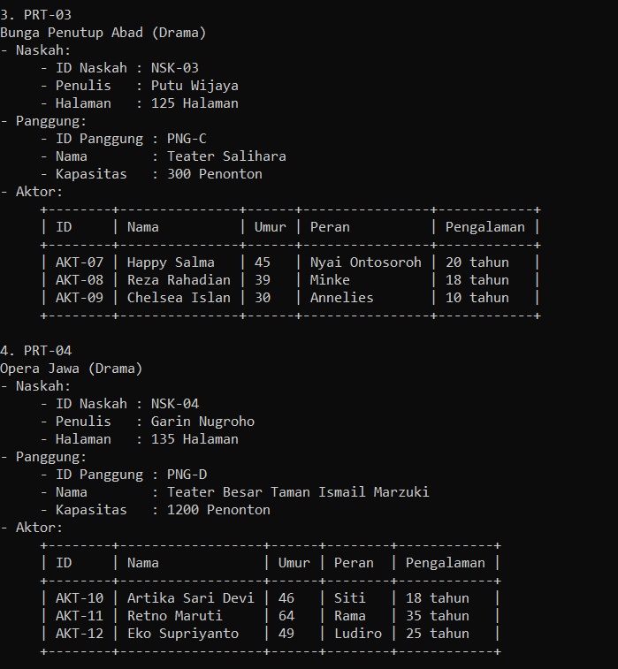

# TP3DPBO2526C

# Tugas Praktikum 3 DPBO

## Janji

Saya Ingrid Gabryella Nainggolan dengan NIM 2506442 mengerjakan TP 3 dalam mata kuliah Desain dan Pemrograman Berorientasi Objek untuk keberkahan-Nya maka saya tidak melakukan kecurangan seperti yang telah dispesifikasikan. Aamiin.

---

## Desain Diagram Program

Diagram di bawah ini merepresentasikan hubungan antar class yang digunakan dalam program, yaitu **Hierarchical Inheritance, Composition, dan Aggregation**.



### Keterangan Hubungan Antar Class

- **Hierarchical Inheritance**: `Pertunjukan` merupakan class induk dari `Drama`, `Musikal`, dan `Komedi`.
- **Composition**: `Pertunjukan` memiliki `Naskah` dan `Panggung` sebagai bagian dari sebuah pertunjukan.
- **Aggregation**: `Pertunjukan` memiliki kumpulan objek `Aktor` yang dibuat sebagai objek tersendiri.
- **Array of Object**: kumpulan objek `Aktor` disimpan dalam list pada Python dan kumpulan pointer objek `Aktor` pada C++.

---

## Atribut dan Method Setiap Kelas

### 1. Pertunjukan

Kelas `Pertunjukan` merupakan kelas induk yang menyimpan informasi umum dari sebuah pertunjukan. Kelas ini juga menjadi dasar pewarisan untuk kelas `Drama`, `Musikal`, dan `Komedi`.

#### Atribut

| Atribut | Tipe Data | Keterangan |
|---|---|---|
| `IdPertunjukan` | string | Menyimpan identitas pertunjukan |
| `Judul` | string | Menyimpan judul pertunjukan |
| `Durasi` | int | Menyimpan durasi pertunjukan |
| `Sutradara` | string | Menyimpan nama sutradara |
| `NaskahPertunjukan` | Naskah | Menyimpan objek naskah yang digunakan |
| `PanggungPertunjukan` | Panggung | Menyimpan objek panggung yang digunakan |
| `DaftarAktor` | Aktor[] | Menyimpan kumpulan objek aktor |
| `JumlahAktor` | int | Menyimpan jumlah aktor |

#### Method

| Method | Keterangan |
|---|---|
| `setIdPertunjukan()` | Mengubah ID pertunjukan |
| `setJudul()` | Mengubah judul pertunjukan |
| `setDurasi()` | Mengubah durasi pertunjukan |
| `setSutradara()` | Mengubah nama sutradara |
| `setNaskah()` | Memasukkan objek Naskah ke dalam pertunjukan |
| `setPanggung()` | Memasukkan objek Panggung ke dalam pertunjukan |
| `setDaftarAktor()` | Memasukkan daftar objek Aktor ke dalam pertunjukan |
| `getIdPertunjukan()` | Mengambil ID pertunjukan |
| `getJudul()` | Mengambil judul pertunjukan |
| `getDurasi()` | Mengambil durasi pertunjukan |
| `getSutradara()` | Mengambil nama sutradara |
| `getNaskah()` | Mengambil objek Naskah |
| `getPanggung()` | Mengambil objek Panggung |
| `getDaftarAktor()` | Mengambil daftar objek Aktor |
| `getJumlahAktor()` | Mengambil jumlah aktor |
| `getKategori()` | Mengembalikan kategori pertunjukan |

---

### 2. Drama

Kelas `Drama` merupakan turunan dari kelas `Pertunjukan`. Kelas ini digunakan untuk merepresentasikan pertunjukan dengan jenis drama.

#### Atribut

| Atribut | Tipe Data | Keterangan |
|---|---|---|
| `Tema` | string | Menyimpan tema drama |
| `JumlahBabak` | int | Menyimpan jumlah babak dalam drama |
| `KonflikUtama` | string | Menyimpan konflik utama dalam cerita |

#### Method

| Method | Keterangan |
|---|---|
| `setTema()` | Mengubah tema drama |
| `setJumlahBabak()` | Mengubah jumlah babak |
| `setKonflikUtama()` | Mengubah konflik utama |
| `getTema()` | Mengambil tema drama |
| `getJumlahBabak()` | Mengambil jumlah babak |
| `getKonflikUtama()` | Mengambil konflik utama |
| `getKategori()` | Mengembalikan kategori `"Drama"` |

---

### 3. Musikal

Kelas `Musikal` merupakan turunan dari kelas `Pertunjukan`. Kelas ini digunakan untuk merepresentasikan pertunjukan musikal.

#### Atribut

| Atribut | Tipe Data | Keterangan |
|---|---|---|
| `JumlahLagu` | int | Menyimpan jumlah lagu |
| `DurasiMusik` | int | Menyimpan durasi musik |
| `TemaMusik` | string | Menyimpan tema musik |

#### Method

| Method | Keterangan |
|---|---|
| `setJumlahLagu()` | Mengubah jumlah lagu |
| `setDurasiMusik()` | Mengubah durasi musik |
| `setTemaMusik()` | Mengubah tema musik |
| `getJumlahLagu()` | Mengambil jumlah lagu |
| `getDurasiMusik()` | Mengambil durasi musik |
| `getTemaMusik()` | Mengambil tema musik |
| `getKategori()` | Mengembalikan kategori `"Musikal"` |

---

### 4. Komedi

Kelas `Komedi` merupakan turunan dari kelas `Pertunjukan`. Kelas ini digunakan untuk merepresentasikan pertunjukan komedi.

#### Atribut

| Atribut | Tipe Data | Keterangan |
|---|---|---|
| `GayaHumor` | string | Menyimpan gaya humor |
| `TemaCerita` | string | Menyimpan tema cerita |
| `TingkatHumor` | string | Menyimpan tingkat humor |

#### Method

| Method | Keterangan |
|---|---|
| `setGayaHumor()` | Mengubah gaya humor |
| `setTemaCerita()` | Mengubah tema cerita |
| `setTingkatHumor()` | Mengubah tingkat humor |
| `getGayaHumor()` | Mengambil gaya humor |
| `getTemaCerita()` | Mengambil tema cerita |
| `getTingkatHumor()` | Mengambil tingkat humor |
| `getKategori()` | Mengembalikan kategori `"Komedi"` |

---

### 5. Naskah

Kelas `Naskah` digunakan untuk menyimpan informasi naskah yang digunakan oleh suatu pertunjukan.

#### Atribut

| Atribut | Tipe Data | Keterangan |
|---|---|---|
| `IdNaskah` | string | Menyimpan identitas naskah |
| `Penulis` | string | Menyimpan nama penulis naskah |
| `JumlahHalaman` | int | Menyimpan jumlah halaman naskah |
| `Bahasa` | string | Menyimpan bahasa yang digunakan dalam naskah |

#### Method

| Method | Keterangan |
|---|---|
| `setIdNaskah()` | Mengubah ID naskah |
| `setPenulis()` | Mengubah nama penulis |
| `setJumlahHalaman()` | Mengubah jumlah halaman |
| `setBahasa()` | Mengubah bahasa naskah |
| `getIdNaskah()` | Mengambil ID naskah |
| `getPenulis()` | Mengambil nama penulis |
| `getJumlahHalaman()` | Mengambil jumlah halaman |
| `getBahasa()` | Mengambil bahasa naskah |

---

### 6. Panggung

Kelas `Panggung` digunakan untuk menyimpan informasi panggung yang digunakan oleh suatu pertunjukan.

#### Atribut

| Atribut | Tipe Data | Keterangan |
|---|---|---|
| `IdPanggung` | string | Menyimpan identitas panggung |
| `NamaPanggung` | string | Menyimpan nama panggung |
| `Kapasitas` | int | Menyimpan kapasitas penonton |
| `JenisPanggung` | string | Menyimpan jenis panggung |

#### Method

| Method | Keterangan |
|---|---|
| `setIdPanggung()` | Mengubah ID panggung |
| `setNamaPanggung()` | Mengubah nama panggung |
| `setKapasitas()` | Mengubah kapasitas panggung |
| `setJenisPanggung()` | Mengubah jenis panggung |
| `getIdPanggung()` | Mengambil ID panggung |
| `getNamaPanggung()` | Mengambil nama panggung |
| `getKapasitas()` | Mengambil kapasitas panggung |
| `getJenisPanggung()` | Mengambil jenis panggung |

---

### 7. Aktor

Kelas `Aktor` digunakan untuk menyimpan informasi aktor yang terlibat dalam suatu pertunjukan.

#### Atribut

| Atribut | Tipe Data | Keterangan |
|---|---|---|
| `IdAktor` | string | Menyimpan identitas aktor |
| `Nama` | string | Menyimpan nama aktor |
| `Umur` | int | Menyimpan umur aktor |
| `Peran` | string | Menyimpan peran yang dimainkan |
| `Pengalaman` | int | Menyimpan lama pengalaman aktor dalam tahun |

#### Method

| Method | Keterangan |
|---|---|
| `setIdAktor()` | Mengubah ID aktor |
| `setNama()` | Mengubah nama aktor |
| `setUmur()` | Mengubah umur aktor |
| `setPeran()` | Mengubah peran aktor |
| `setPengalaman()` | Mengubah pengalaman aktor |
| `getIdAktor()` | Mengambil ID aktor |
| `getNama()` | Mengambil nama aktor |
| `getUmur()` | Mengambil umur aktor |
| `getPeran()` | Mengambil peran aktor |
| `getPengalaman()` | Mengambil pengalaman aktor |

---

## Desain Program

### 1. Hierarchical Inheritance

Program menggunakan konsep **Hierarchical Inheritance**, yaitu satu kelas induk memiliki beberapa kelas turunan.

Kelas `Pertunjukan` menjadi kelas induk yang diturunkan menjadi tiga kelas:

```text
                Pertunjukan
               /     |     \
           Drama   Musikal  Komedi
```

Dengan desain tersebut, atribut dan method umum yang dimiliki oleh pertunjukan dapat digunakan kembali oleh kelas turunannya.

Kelas `Drama`, `Musikal`, dan `Komedi` juga memiliki atribut dan method khusus sesuai dengan karakteristik masing-masing jenis pertunjukan.

Selain itu, method `getKategori()` pada kelas `Pertunjukan` dioverride oleh kelas turunannya sehingga setiap objek dapat memberikan kategori masing-masing.

---

### 2. Composition

Program menggunakan konsep **Composition** antara kelas `Pertunjukan` dengan kelas `Naskah` dan `Panggung`.

Hubungannya adalah:

```text
Pertunjukan ◆── Naskah
            ◆── Panggung
```

Objek `Naskah` dimasukkan ke dalam objek `Pertunjukan` menggunakan method `setNaskah()`.

Objek `Panggung` dimasukkan ke dalam objek `Pertunjukan` menggunakan method `setPanggung()`.

Dengan demikian, `Naskah` dan `Panggung` menjadi bagian dari sebuah `Pertunjukan`.

---

### 3. Aggregation

Program menggunakan konsep **Aggregation** antara kelas `Pertunjukan` dengan kelas `Aktor`.

Hubungannya adalah:

```text
Pertunjukan ◇── Aktor
```

Objek `Aktor` dibuat secara terpisah dan kemudian dikumpulkan sebagai daftar aktor yang terlibat dalam suatu pertunjukan.

Daftar objek tersebut kemudian dimasukkan ke dalam objek `Pertunjukan` menggunakan method `setDaftarAktor()`.

Aggregation digunakan karena satu pertunjukan dapat memiliki beberapa aktor dan objek aktor tersebut merupakan objek yang berdiri sendiri.

---

### 4. Array of Object

Program juga menerapkan **Array of Object** untuk menyimpan beberapa objek `Aktor`.

Pada Python, kumpulan objek aktor disimpan menggunakan list:

```python
aktor_hamilton = [
    Aktor("AKT-01", "Lin-Manuel Miranda", 40, "Alexander Hamilton", 15),
    Aktor("AKT-02", "Leslie Odom Jr.", 39, "Aaron Burr", 12),
    Aktor("AKT-03", "Phillipa Soo", 36, "Eliza Hamilton", 11)
]
```

Daftar tersebut kemudian dimasukkan ke dalam objek `Pertunjukan` menggunakan method `setDaftarAktor()`.

Pada C++, konsep yang sama diterapkan menggunakan kumpulan pointer objek `Aktor`.

Array of Object digunakan agar satu pertunjukan dapat memiliki lebih dari satu aktor.

---

## Struktur File

```text
TP3DPBO2526C/
│
├── Python/
│   ├── Dokumentasi/
│   │   ├── data_awal_py.png
│   │   ├── add_data_hasil_1_py.png
│   │   └── add_data_hasil_2_py.png
│   │
│   └── Program/
│       ├── Pertunjukan.py
│       ├── Drama.py
│       ├── Komedi.py
│       ├── Musikal.py
│       ├── Naskah.py
│       ├── Aktor.py
│       ├── Panggung.py
│       └── Main.py
│
├── CPP/
│   ├── Dokumentasi/
│   │   ├── data_awal_cpp.png
│   │   ├── add_data_hasil_1_cpp.png
│   │   └── add_data_hasil_2_cpp.png
│   │
│   └── Program/
│       ├── Pertunjukan.cpp
│       ├── Drama.cpp
│       ├── Komedi.cpp
│       ├── Musikal.cpp
│       ├── Naskah.cpp
│       ├── Aktor.cpp
│       ├── Panggung.cpp
│       └── Main.cpp
│
├── diagram_tp3.png
└── README.md
```

Folder `Dokumentasi` digunakan untuk menyimpan screenshot hasil program dari setiap bahasa pemrograman.

---

## Dokumentasi

Dokumentasi berisi screenshot atau screenrecord dari hasil implementasi program pada setiap bahasa pemrograman.

### Python

- Tampilan data awal.



- Tampilan data setelah ditambahkan.





---

### C++

- Tampilan data awal.



- Tampilan data setelah ditambahkan.





---

## Kesimpulan

Program Manajemen Pertunjukan menerapkan konsep Pemrograman Berorientasi Objek berupa **Hierarchical Inheritance**, **Composition**, **Aggregation**, dan **Array of Object**.

Hierarchical Inheritance diterapkan dengan menjadikan `Pertunjukan` sebagai kelas induk dari `Drama`, `Musikal`, dan `Komedi`.

Composition diterapkan dengan menghubungkan `Pertunjukan` dengan `Naskah` dan `Panggung`.

Aggregation diterapkan dengan menghubungkan `Pertunjukan` dengan kumpulan objek `Aktor` yang dibuat secara terpisah.

Array of Object diterapkan untuk menyimpan beberapa objek `Aktor` dalam satu pertunjukan dan beberapa objek `Pertunjukan` dalam program utama.

Program juga menggunakan setter dan getter untuk mengakses serta mengubah data setiap objek. Data ditampilkan sebelum dan sesudah dilakukan penambahan objek pertunjukan sehingga penerapan konsep OOP dapat terlihat melalui hasil program.